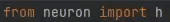

[](https://codecov.io/gh/Helveg/patch)
[](https://github.com/psf/black)
[](https://patch.readthedocs.io/en/latest/?badge=latest)




_*No ducks were punched during the construction of this monkey patch._

# Installation

```
pip install nrn-patch
```

## Minimal requirements

* Python 3.8+
* NEURON 8.0+

# Philosophy

Pythonic reinvention of the NEURON Python interface:

  - **Drop-in replacement:** No breaking changes between Patch and NEURON. All
    your code works as is. Patch automagically fixes bugs and reduces
    complexity in NEURON by having an opinion, and adds new convenient methods.
  - **Loud errors:** silent failures and gotchas are caught and raise
    loud errors; so that when it runs, it runs.
  - **Strong referencing:** Objects connected to each other will never disappear
    until you disconnect them.
  - **Demystified:** The simplest form of each instruction does the most obvious thing.
    Patch frequently replaces 5 or more undocumented mystical voodoo steps by 1 clearly named function.
  - **Just add water:** Serial or parallel, doesn't matter, `p.run()` will run your
    simulation with no extra steps. No `load_file`, `finitialize`, `fadvance`, `run`,
    `continuerun`, `tstop`, `set_maxstep`, `setup_transfer`, `setgid2node`, `gid_connect`,
    `cell`, `outputcell`, `psolve` required.

# Basic usage

Use it like you would use NEURON. The wrapper doesn't make any changes to the interface,
it just patches up some of the more frequent and ridiculous gotchas.

Patch supplies a new interpreter `p`, the `PythonHocInterpreter` which wraps the
standard HOC interpreter `h` provided by NEURON. Any objects returned will either be
`PythonHocObject`'s wrapping their corresponding NEURON object, or whatever NEURON
returns.

When using just Patch the difference between NEURON and Patch objects is handled
transparently, but if you wish to mix interpreters you can transform all Patch objects
back to NEURON objects with `obj.__neuron__()`, or the `transform` function.

## Example

``` python
from patch import p
import glia as g

section = p.Section()
point_process = g.insert(section, "AMPA")
point_process.stimulate(start=10, number=5, interval=10, weight=0.04)
```

`.stimulate` creates both the `NetCon` and `NetStim`, and sets their properties, and
stores references to eachother so that Python doesn't garbage collect anything
until we're done with it.

Even when you forget to set values, the Patch defaults have a visible effect.
Here we forget to set the duration of a voltage clamp, but by default it will
be active the first 100ms of the simulation, so that you can see that the voltage
clamp is in fact inserted and working, but you forgot to set the duration:

```
section.vclamp(holding=-70, voltage=20)
```
